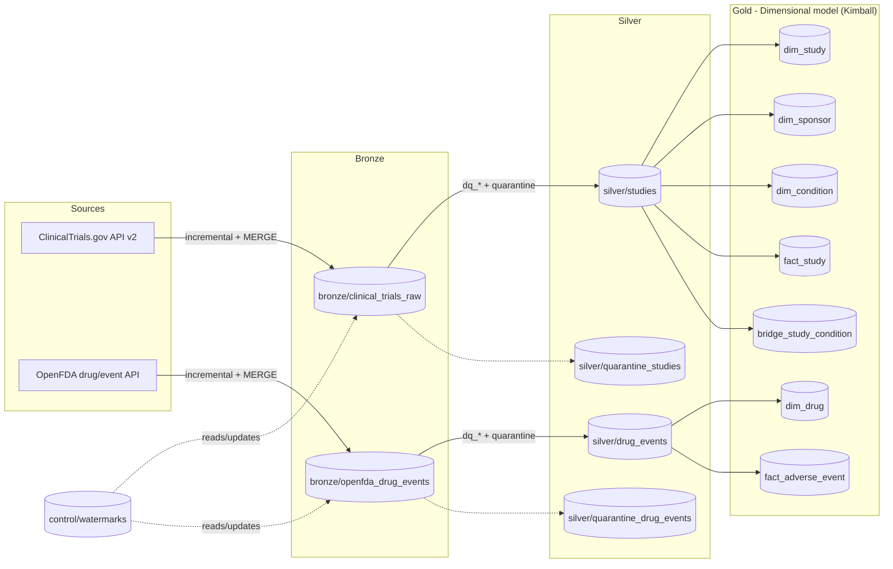

# Medallion Life Science

A life-sciences data pipeline that ingests, cleans, and models data from **ClinicalTrials.gov** and **OpenFDA (drug/event)** using the **Medallion architecture (Bronze → Silver → Gold)** on top of **PySpark + Delta Lake**, with a dimensional (Kimball) model in the Gold layer.

## Notebooks in this project

This repository ships **two notebooks** that implement the exact same Medallion pipeline logic (same sources, same cleaning rules, same Gold model), but target **different storage backends**. Pick whichever matches where you want the Delta tables to live.

### `Medallion.ipynb` — local filesystem version

Runs entirely on your machine, writing every Delta table under `Medallion_life_science/data/`. This is the easiest way to run the whole pipeline end-to-end without any cloud account.

Step-by-step flow:
1. **Pre-system setup** — installs `pyspark`/`delta-spark`, defines `CONFIG` (all Bronze/Silver/Gold/watermark paths resolved under the local `data/` folder), sets up the `logger`, and defines the `run_stage(...)` context manager used to time and audit every critical stage.
2. **Spark + Delta Lake setup** — creates the local `SparkSession` with the Delta extension enabled.
3. **Bronze — ClinicalTrials.gov** — downloads studies incrementally (using a watermark stored at `control/watermarks`), writes them to `bronze/clinical_trials_raw` with audit columns (`_ingested_at`, `_source`, `_pipeline_run_id`, `_ingestion_date`), using `MERGE` for upserts (falls back to `overwrite` on first run).
4. **Silver — ClinicalTrials.gov** — extracts nested JSON fields safely (`safe_nested_col` guards against `FIELD_NOT_FOUND` when a field is missing from a given API response), cleans/types columns, deduplicates by `nct_id`, applies `dq_*` data-quality rules, and splits records into valid (`silver/studies`) vs. quarantine (`silver/quarantine_studies`).
5. **OpenFDA — Bronze + Silver** — repeats the same raw-ingest → clean → quarantine pattern for drug adverse events (`bronze/openfda_drug_events` → `silver/drug_events` / `silver/quarantine_drug_events`).
6. **Gold — dimensional model** — builds `dim_study`, `dim_sponsor`, `dim_condition`, `dim_drug`, `fact_study`, `fact_adverse_event`, and `bridge_study_condition`, then saves them all under `gold/`.
7. **Interface** — an `ipywidgets` explorer to browse any Bronze/Silver/Gold table (schema + row preview) directly from the local Delta files.
8. **Charts** — `matplotlib` visualizations over the Gold layer (studies by status/phase, top sponsors, top drugs by adverse events).
9. **Azure Data Lake demo** — a self-contained, independent `DataLakeManager` class (uses `azure-storage-file-datalake`) with a small `__main__` demo that uploads/reads/lists sample JSON files in Bronze/Silver/Gold containers. This section is illustrative only — it does **not** feed back into the Spark pipeline above; it exists to show how the same project could talk to Azure Blob/ADLS Gen2 directly via the Python SDK (see `Medallion_azure.ipynb` for the fully integrated version).

### `Medallion_azure.ipynb` — Azure Data Lake (ADLS Gen2) version

A duplicate of the local notebook, adapted so that **every** Bronze/Silver/Gold/watermark table is read from and written to an **Azure Data Lake Storage Gen2** container instead of the local disk — nothing is persisted locally.

What's different from `Medallion.ipynb`:
1. **Azure credentials** — the central `CONFIG` cell loads two environment variables from `.env`: `key1azuredatalake` (the storage account access key) and `key1azuredatalakeconx` (the full connection string, used to derive the storage account name automatically). It raises a clear error if either is missing.
2. **`abfss://` paths** — instead of local folder paths, every `CONFIG` entry (`bronze_path`, `silver_path`, `silver_quarantine_path`, `bronze_openfda_path`, `silver_openfda_path`, `silver_openfda_quarantine_path`, `gold_base_path`, `watermark_path`) is built as an `abfss://<container>@<account>.dfs.core.windows.net/...` URI via a small `_abfss(...)` helper.
3. **Container bootstrap** — a `DataLakeManager` class (adapted from the local notebook's Azure demo) connects once via the SDK and creates the `medallion` container if it doesn't exist yet, then lists existing containers.
4. **Folder bootstrap** — a dedicated cell walks every required Bronze/Silver/Gold/control path and creates any missing directory in the Data Lake container up front, so later Spark writes never fail due to a missing parent folder.
5. **Spark + Hadoop Azure setup** — the `SparkSession` is built with the `hadoop-azure` and `azure-storage` Maven packages (passed via Delta's `extra_packages`, since `configure_spark_with_delta_pip()` would otherwise silently overwrite `spark.jars.packages`), and authenticates against the storage account via `fs.azure.account.key.<account>.dfs.core.windows.net`.
6. **Same Bronze → Silver → Gold logic** — ingestion, cleaning, quality rules, and the Gold dimensional model are identical to `Medallion.ipynb`; only the underlying storage path scheme changes.
7. **Interface & charts read from Azure** — the `ipywidgets` explorer and the `matplotlib` charts cell no longer check `os.path.exists(...)` (that only works for local files); they instead try `spark.read.format("delta").load(path)` directly against the `abfss://` path and catch the exception if a table doesn't exist yet, so both the exploration UI and the charts always reflect what's actually stored in Azure.
8. **No local `DataLakeManager` demo cell** — that script was merged into the container/folder bootstrap cells described above, since Azure connectivity is now a first-class part of the pipeline rather than a separate illustration.

## Pipeline architecture



## #bronze — Raw ingestion layer

The Bronze layer stores data **exactly as received** from each source API, preserving full fidelity for reprocessing and auditability.

- **Sources ingested**:
  - `ClinicalTrials.gov API v2` → saved to `bronze/clinical_trials_raw`.
  - `OpenFDA drug/event API` → saved to `bronze/openfda_drug_events`.
- **Audit columns** added to every record: `_ingested_at`, `_source`, `_pipeline_run_id`, `_ingestion_date`.
- **Incremental loading**: each source has its own **watermark** (stored in `control/watermarks`) tracking the last successful ingestion point, so re-runs only fetch new/changed records instead of a full reload.
- **Upsert strategy**: new batches are merged into Bronze via Delta Lake `MERGE` (`whenMatchedUpdateAll` / `whenNotMatchedInsertAll`); on first run (table doesn't exist yet) it falls back to a plain `overwrite`.
- **Resilience**: HTTP requests use a retry-enabled session (`create_session_with_retries`) to tolerate transient API failures.
- **Theory applied**: Write-Audit-Publish pattern and monotonicity checks on ingestion timestamps.

## #silver — Cleaned and quality-checked layer

The Silver layer transforms raw Bronze records into **typed, validated, deduplicated** data, splitting it into valid records and a quarantine table.

- **Field extraction**: nested/semi-structured JSON fields are flattened using a `safe_nested_col()` helper that safely returns `null` when a field is missing from the source schema (fixes `FIELD_NOT_FOUND` errors across API schema drift).
- **Deduplication**: records are deduplicated by natural key (`nct_id` for studies).
- **Data quality rules (`dq_*` flags)**:
  - `dq_nct_id_valid` — matches `NCT########` pattern.
  - `dq_title_valid` — non-null title with minimum length.
  - `dq_enrollment_valid` — non-negative enrollment count.
  - `dq_dates_valid` — start date not after completion date.
  - `dq_status_valid` — status is one of the allowed `overall_status` values.
  - `dq_sponsor_valid` — non-null, minimum-length sponsor name.
- **Validity summary**: an `is_valid` column aggregates all `dq_*` flags; records failing any rule go to the **quarantine** table (`silver/quarantine_studies`, `silver/quarantine_drug_events`) instead of being dropped.
- **Incremental MERGE**: valid records are merged into Silver by primary key; quarantine tables are overwritten each run.
- **OpenFDA Silver**: analogous cleaning/casting (dates, serious-event flags, patient sex, drug/reaction counts) with its own valid/quarantine split.

## #gold — Dimensional model (serving layer)

The Gold layer reshapes Silver data into a **Kimball-style star schema**, optimized for querying, BI tools, and analytics — no more "cleaning", just **semantic modeling**.

- **Dimensions**:
  - `dim_study` — one row per clinical trial (natural key `study_id` = `nct_id`).
  - `dim_sponsor` — deduplicated sponsors with a **stable surrogate key** generated via `xxhash64` (consistent across runs).
  - `dim_condition` — distinct medical conditions referenced by studies.
  - `dim_drug` — distinct drug names extracted from OpenFDA adverse event reports.
- **Facts**:
  - `fact_study` — one row per study, linked to `dim_sponsor` via FK, enrollment/status/phase measures.
  - `fact_adverse_event` — one row per reported adverse event, linked to `dim_drug` via FK.
- **Bridge table**:
  - `bridge_study_condition` — resolves the many-to-many relationship between studies and conditions.
- **What's applied**: dimensional modeling, fact/dimension separation, surrogate keys, bridge tables for many-to-many relationships, and optional pre-aggregation for BI consumption.

## Error handling & observability

Every critical stage (Bronze save, Gold save) runs inside the `run_stage(...)` context-manager helper, which logs the stage name, start time, duration, success, or failure (with full traceback) to the pipeline logger — giving end-to-end traceability and lineage for debugging and audits.

## Interface & visualization

The notebook includes:
- An **interactive explorer** (`ipywidgets`) to browse any Bronze/Silver/Gold table, inspect its schema, and preview rows — without relying on `DataFrame.toPandas()` (removed `distutils` dependency broke it on Python 3.12), using a manual `row.asDict()` → `pandas.DataFrame` conversion instead.
- **Charts** (`matplotlib`) over the Gold layer: studies by status, studies by phase, top sponsors by study count, and top drugs by reported adverse events.

## How to run

```bash
python3 -m venv .venv
source .venv/bin/activate
pip install -r requirements.txt
cp .env.example .env   # fill in AZURE_STORAGE_CONNECTION_STRING, key1azuredatalake and key1azuredatalakeconx as needed
```

- Open `Medallion.ipynb` and run the cells in order using the `.venv` kernel for the **local filesystem** version.
- Open `Medallion_azure.ipynb` and run the cells in order for the **Azure Data Lake (ADLS Gen2)** version — make sure `key1azuredatalake` and `key1azuredatalakeconx` are set in `.env` first.

## Next steps

The current notebooks already deliver a complete, working Medallion pipeline. The following improvements would move the project closer to a production-grade setup:

### 1. Modular Python package structure

Refactor the notebook logic into a proper Python package so that each responsibility lives in its own module. A possible layout:

```text
medallion_life_science/
├── config/
│   └── settings.py              # central CONFIG + environment loading
├── src/
│   ├── ingestion/
│   │   ├── clinicaltrials.py    # fetch + retries for ClinicalTrials.gov
│   │   └── openfda.py           # fetch + retries for OpenFDA
│   ├── bronze/
│   │   └── writer.py            # MERGE / overwrite logic + audit columns
│   ├── silver/
│   │   ├── clinicaltrials.py    # extraction, cleaning, dq_* rules
│   │   └── openfda.py
│   ├── gold/
│   │   └── dimensional_model.py # dims, facts, bridge tables
│   ├── quality/
│   │   └── rules.py             # reusable data-quality helpers
│   └── utils/
│       ├── spark.py             # SparkSession factory
│       ├── watermark.py         # get / update watermark
│       └── logging.py           # run_stage context manager + logger
├── notebooks/                   # thin notebooks that only call the package
├── tests/
└── requirements.txt
```

This separation makes the code testable, reusable, and easier to maintain.

### 2. Scheduled execution with GitHub Actions

Add a GitHub Actions workflow that runs the pipeline on a schedule (or on demand) without manual intervention.

Example workflow (`.github/workflows/medallion-pipeline.yml`):

```yaml
name: Medallion Pipeline

on:
  schedule:
    - cron: "0 6 * * 1-5"   # every weekday at 06:00 UTC
  workflow_dispatch:          # allow manual runs

jobs:
  run-pipeline:
    runs-on: ubuntu-latest
    steps:
      - uses: actions/checkout@v4

      - name: Set up Python
        uses: actions/setup-python@v5
        with:
          python-version: "3.11"

      - name: Install dependencies
        run: |
          python -m pip install --upgrade pip
          pip install -r requirements.txt

      - name: Run pipeline
        env:
          # Azure credentials (stored as GitHub Secrets)
          key1azuredatalake: ${{ secrets.AZURE_STORAGE_KEY }}
          key1azuredatalakeconx: ${{ secrets.AZURE_STORAGE_CONNECTION_STRING }}
        run: |
          python -m src.main   # or papermill / jupyter nbconvert on the notebook
```

Secrets (`AZURE_STORAGE_KEY`, `AZURE_STORAGE_CONNECTION_STRING`, etc.) should be stored in the repository’s GitHub Secrets so that credentials never appear in the code.
